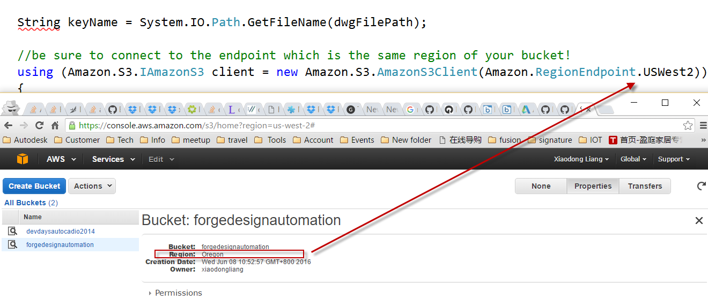

Design Automation .NET Library
========================
(Formely AutoCAD I/O)

## Description
This is an auxiliary library with helper methods to perform tasks related to Design Automation. It packs the workflows of creating activity, submitting workitem, deleting activity, updating activity etc. It also provides the some workflows of AWS S3 such as uploading objects to S3 bucket. Test with other client projects such as 
  * [design.automation-windows-services-sample](https://github.com/Autodesk-Forge/design.automation-windows-services-sample)
  * [design.automation-workflow-winform-sample](https://github.com/Autodesk-Forge/design.automation-workflow-winform-sample)

## Thumbnail
 

## Setup

### Dependencies 
* Download and install [Visual Studio](https://visualstudio.microsoft.com/downloads/). In the latest test, Visual Studio version is 2017. 
* If testing with AWS S3, ensure you have already [AWS account and S3 storage](https://aws.amazon.com/s3/). 

### Prerequisites
1. **Forge Account**: Learn how to create a Forge Account, activate subscription and create an app at [this tutorial](http://learnforge.autodesk.io/#/account/). Make sure to select the service **Design Automation**.
2. Make a note with the credentials (client id and client secret) of the app. 

## Running locally  
* Open the project. Restore the packages of the project by [NuGet](https://www.nuget.org/). The simplest way is
  * VS2012: Projects tab >> Enable NuGet Package Restore. Then right click the project>>"Manage NuGet Packages for Solution" >> "Restore" (top right of dialog)
  * VS2013/VS2015/2017:  right click the project>>"Manage NuGet Packages for Solution" >> "Restore" (top right of dialog)
* Add other missing references
* Build the library project to generate the dll.
* Test with other client projects such as 
  * [design.automation-windows-services-sample](https://github.com/Autodesk-Forge/design.automation-windows-services-sample)
  * [design.automation-workflow-winform-sample](https://github.com/Autodesk-Forge/design.automation-workflow-winform-sample)
  
## Troubleshooting
* be sure to connect to the endpoint which is the same region of your S3 bucket!  line 168 of [GeneralUtilities.cs](./AutoCADIOUtil/GeneralUtilities.cs)
   

## Further Reading 
* [Design Automation API help](https://forge.autodesk.com/en/docs/design-automation/v2/developers_guide/overview/)
* [ Intro to Design Automation API Video](https://www.youtube.com/watch?v=GWsJM344CJE&t=107s)
* [Working with Amazon S3 Buckets](https://docs.aws.amazon.com/AmazonS3/latest/dev/UsingBucket.html)  
 
## Known Issues
* as of writing, Design Automation of Forge is released with version 2. Odata is used with .NET project. In futher version, OData might not be used. 

## License

These samples are licensed under the terms of the [MIT License](http://opensource.org/licenses/MIT). Please see the [LICENSE](LICENSE) file for full details.

## Written by 

Jonathan Miao & Albert Szilvasy
